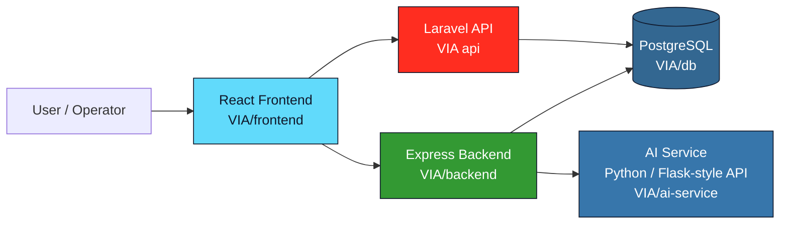

# VIA — Road Accident Reporting Platform

<div align="center">


</div>

A full-stack digital platform for reporting, reviewing, and managing road traffic accidents with a modern web interface, AI-assisted processing, and a secure API layer.

## Overview

VIA is designed to help users report accidents quickly, track what was submitted, and provide backend support for risk analysis and incident management. The project combines a React frontend, a Node/Express API, a PostgreSQL database, an AI processing service, and a Laravel-based API layer for structured data handling and extensibility.

### Highlights

- Modern dashboard-driven frontend for accident reporting and monitoring
- Express-based backend with authentication and route handling
- AI service for intelligent processing and supporting classification tasks
- Laravel API for robust server-side application logic
- Dockerized local setup for fast onboarding and testing
- Clean monorepo structure suitable for portfolio presentation and further expansion

---

## Architecture



---

## Tech Stack

### Frontend

- React + Vite
- Tailwind CSS
- React Router

### Backend

- Node.js
- Express.js
- PostgreSQL
- JWT-based auth flow

### AI Layer

- Python
- AI service endpoint for smart processing and integrations

### API Layer

- Laravel 12
- PHP 8.2+
- Composer-managed setup

### Deployment / Local Dev

- Docker Compose
- Environment-based configuration

---

## Repository Structure

```text
VIA website/
├── README.md
├── SETUP.md
├── VIA/
│   ├── ai-service/
│   ├── backend/
│   ├── frontend/
│   ├── db/
│   ├── docker-compose.yml
│   └── package.json
├── VIA api/
│   ├── app/
│   ├── config/
│   ├── database/
│   ├── routes/
│   ├── resources/
│   ├── composer.json
│   └── package.json
└── .gitignore
```

---

## Getting Started

### Prerequisites

- Node.js 18+
- npm
- Python 3.10+
- PHP 8.2+
- Composer
- Docker + Docker Compose
- Git

### Recommended quick start

```bash
cd VIA
docker compose up --build
```

This starts the main application services locally:

- Frontend: http://localhost:3000
- Backend: http://localhost:4000
- AI service: http://localhost:5000
- PostgreSQL: localhost:5432

### Manual setup

For detailed local installation steps, see [SETUP.md](SETUP.md).

---

## Project Goals

This project was built to demonstrate practical full-stack engineering in a realistic domain:

- user-facing reporting experience
- backend processing and validation
- AI-assisted workflows
- API integration patterns
- Dockerized deployment readiness
- modular architecture for future extension

---

## Project Showcase

VIA brings accident reporting, operational review, and intelligent processing into one connected workflow.

### Feature Highlights

- **Fast accident reporting** — Capture incident details through a focused, dashboard-driven React interface.
- **Incident monitoring** — Track submitted reports and support review workflows from a central workspace.
- **Secure access** — Protect user workflows with JWT-based authentication through the Express backend.
- **AI-assisted processing** — Send report data to the Python service for classification and future risk-analysis integrations.
- **Structured data management** — Use PostgreSQL-backed services and Laravel API endpoints for consistent server-side handling.
- **Containerized development** — Start the frontend, backend, AI service, and database together with Docker Compose.

### Demo Links

Run the application with `cd VIA && docker compose up --build`, then open:

- [VIA frontend](http://localhost:3000) — Main reporting and monitoring experience
- [Express backend](http://localhost:4000) — Backend service base URL
- [AI service](http://localhost:5000) — AI processing service base URL
- [Laravel API](VIA%20api/README.md) — API-layer setup and usage notes
- [Setup guide](SETUP.md) — Manual installation and local development instructions

The local service links require the corresponding Docker Compose services to be running.

### Team Contribution Breakdown

| Contribution area        | Responsibilities                                                                                      |
| ------------------------ | ----------------------------------------------------------------------------------------------------- |
| Product and UX           | Define reporting workflows, dashboard information architecture, and responsive user journeys.         |
| Frontend engineering     | Build React views, reusable components, form interactions, routing, and API integration.              |
| Backend engineering      | Implement Express routes, authentication, validation, report handling, and service integration.       |
| AI integration           | Develop the Python service interface and connect classification or risk-analysis workflows.           |
| API and data engineering | Maintain Laravel controllers, PostgreSQL schemas, migrations, seeders, and data contracts.            |
| DevOps and quality       | Maintain Docker Compose, environment configuration, testing, documentation, and deployment readiness. |

For a team presentation, assign names and percentage ownership to the contribution areas above based on the actual work completed.

---

## Development Notes

- The repository contains two related application stacks that can be used together or independently.
- The `VIA/` folder contains the fuller app stack for containerized local development.
- The `VIA api/` folder provides a Laravel API layer for server-side logic and extension opportunities.
- Environment secrets should remain local and should not be committed to version control.

---

## License

This project is currently shared as a development portfolio project without a separate project license file unless otherwise specified by the owner.

---

## Contact / Portfolio

Basel Yasser

- Portfolio: [MyPortfolio.com](https://basel-portfolio.lovable.app/)
- Email: [baselderbala1@gmail.com](mailto:baselderbala1@gmail.com)
